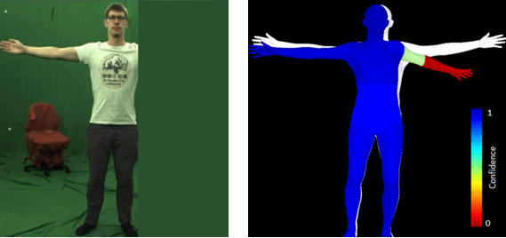

# Confidence on Mesh
The goal of this project is to add confidence to the generated mesh by the SPIN model. A sample shown in the figure below, where the occlusion forces the SPIN model to estimate inaccurate mesh. However, our model detects the inaccurate parts of the mesh.



## To run the demo:
1-	Go to your server and create a folder meshConfidence
2-	Create a docker file with the content.
3-	Create the docker image: ```docker image build -t confidence .```
